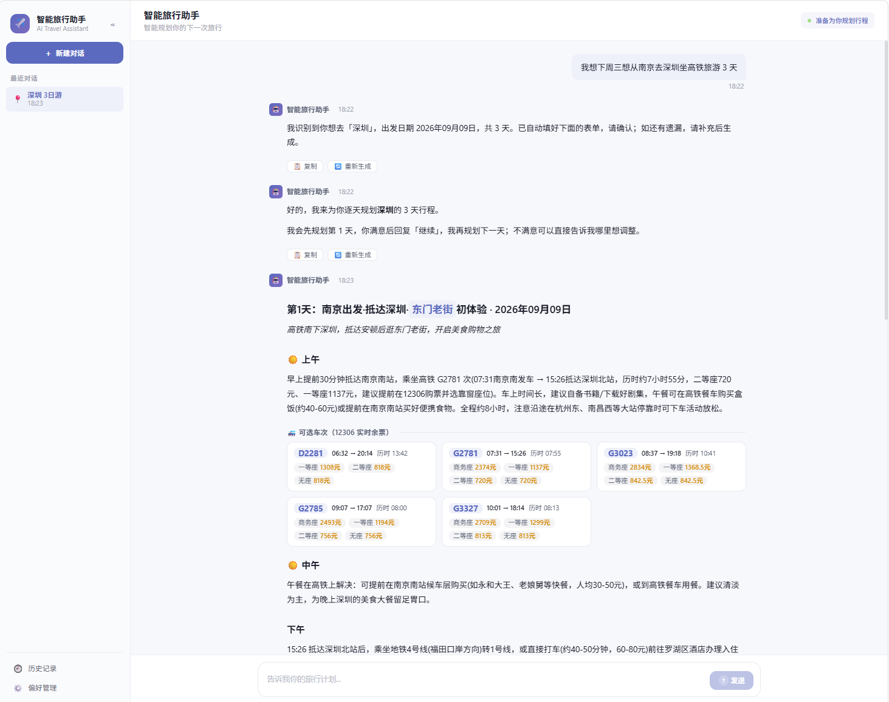
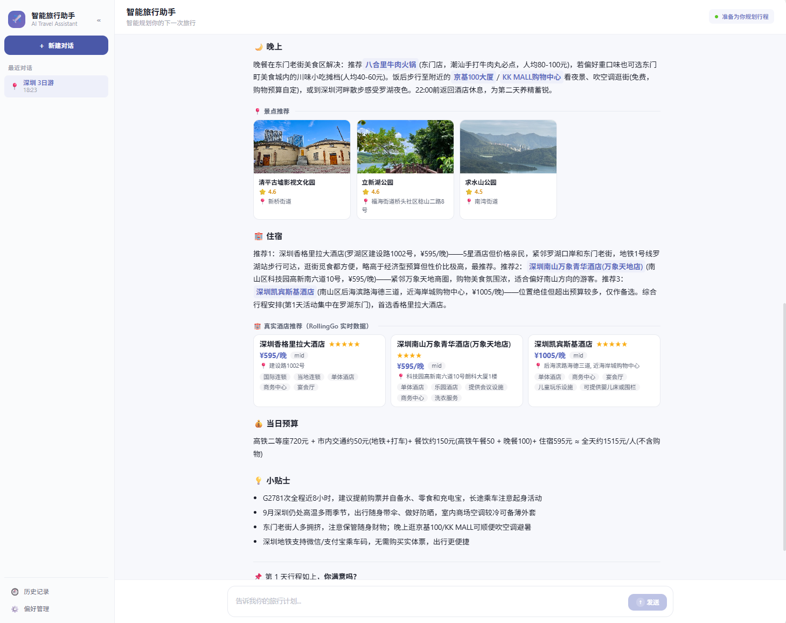

# 智能旅行助手（全栈 Agent 应用）

基于 **LangGraph 多 Agent 编排 + RAG 商旅知识库 + 实时数据 MCP + Vue3 前端**的智能旅行规划系统。采用 Plan-and-Solve 逐天交付模式，支持自然语言对话与表单确认混合交互，通过 SSE 流式输出实时展示 AI 思考过程与行程生成。

---

## 🖼️ 演示截图

**对话交互与逐天行程规划**（意图识别自动填表 → 12306 真实车次卡片 → 渐进式生成）



**单日行程详情**（景点推荐卡片 + 真实酒店推荐 + 当日预算 + 小贴士）



---

## ✨ 核心亮点

### 🎯 LLM 语义意图识别
- 基于 LLM 语义理解的多意图识别，支持 **6 大类意图**：行程规划、事项收集、偏好管理、信息查询、记忆查询、RAG 知识问答
- 自然语言理解，无需关键词匹配；意图识别后自动提取关键实体并填充确认表单

### 🧠 渐进式交互（Plan-and-Solve）
- 行程按"先整体规划、**一次只生成一天**、用户确认后再继续下一天"的模式交付
- 每天包含可落地的车次、酒店、景点、天气与当日预算，用户可随时回复修改意见重新生成当天
- 结合 MemorySaver 管理多轮会话与逐天推进状态，支持中断恢复

### 🔌 三类实时数据 MCP 集成
- **高德地图 MCP**：景点 / 美食 POI 查询与热门景点推荐
- **12306 MCP**：真实车次、票价、余票查询（支持高铁 / 动车 / 普速列车）
- **RollingGo 酒店 MCP**：实时酒店推荐，按用户预算浮动上限智能兜底
- 规划时同步查询目的地天气，行程附带真实车票、酒店卡片与地图信息

### 📚 RAG 商旅知识库
- Milvus 向量数据库 + bge-small-zh-v1.5 中文向量模型（本地部署）
- 差旅政策 / 报销标准 / 预订指南等 8 类文档（141 条知识片段）
- 余弦相似度检索 + 文档溯源，支持"出差住宿标准是多少"等自然语言问答

### 💾 长期记忆与偏好管理
- 后端 JSON 长期记忆自动记录出发地（last_origin）、交通偏好、美食偏好
- 用户未指明出发地时自动补全并提示依据；智能识别偏好追加（"还喜欢"）与覆盖（"改成"）

### 🛡️ 稳定性保障
- 熔断器：连续失败后自动熔断，保护 LLM 服务
- 指数退避重试：对超时、429、5xx 等可重试错误自动重试
- 确定性兜底：口语日期预处理器（明天 / 下周六 / X 天后 / 两天全覆盖）与交通方式显式提取器，杜绝模型擅自改写用户选择

---

## 系统架构

```
用户输入（自然语言）
   ↓
┌──────────────────────────────────────────────────────────┐
│  LangGraph StateGraph 编排引擎                            │
│                                                          │
│  [START]                                                 │
│    ↓                                                     │
│  [intent_node] 意图识别 + 关键实体提取                    │
│    ↓ 条件路由（按 intents 分流）                          │
│  ┌────────────── 并行 fan-out（Send API）─────────────┐  │
│  │  [event_collection]  [preference]  [rag]  [info]  │  │
│  │   事项收集            偏好管理      检索  信息查询  │  │
│  └───────────────────────────────────────────────────┘  │
│    ↓ 汇总                                                │
│  [aggregate_node] 结果聚合                               │
│    ↓                                                     │
│  [day_planning_node] 逐天行程规划（Plan-and-Solve）      │
│    ↓ 条件边（currentDay < totalDays?）                   │
│     是 → 回到 day_planning 生成下一天                    │
│     否 → [END]                                           │
└──────────────────────────────────────────────────────────┘
   ↓
SSE 流式输出 → 前端渲染（Markdown + 触发词卡片 + 地图）
```

### 多模型分派

| 任务 | 模型 | 说明 |
|------|------|------|
| 行程规划（含深度思考） | GLM-5.3-Flash | reasoning_effort=high，实时展示思考过程 |
| 意图识别 / 默认对话 / RAG | DeepSeek-V4-Flash | 轻量快速，降低延迟 |

所有模型通过腾讯云 TokenHub（OpenAI 兼容接口）统一调用，配置于 `backend/.env`。

---

## 核心功能

### 1. 意图识别（6 大类）

| 意图 | 说明 | 示例 |
|------|------|------|
| `itinerary_planning` | 规划未来行程 | "我想去西安玩4天，从南京出发" |
| `event_collection` | 收集行程要素 | 自动提取出发地、目的地、日期、交通方式 |
| `preference` | 管理用户偏好（追加 / 覆盖） | "我还喜欢如家"、"我搬家到上海了" |
| `information_query` | 实时信息查询 | "杭州明天天气怎么样？" |
| `memory_query` | 查询历史记忆 | "我去过哪些地方？" |
| `rag_knowledge` | 商旅知识库问答 | "出差住宿标准是多少？" |

### 2. 事项收集与确定性兜底

- 自动提取：出发地、目的地、出发日期、返程日期、出行目的、交通方式、预算
- **口语日期预处理**：覆盖"明天 / 后天 / 下周六 / X 天后 / 两天 / 一周"等日常表达
- **交通方式显式提取**：用户指定"坐火车"即强制采用火车，杜绝模型按距离擅自改写
- 缺失信息时自动填充表单并提示用户补充必要信息

### 3. 渐进式交互（Plan-and-Solve 逐天规划）

- 第 1 天生成后，用户回复"继续"生成第 2 天；回复"第1天想去迪士尼"可重新生成当天
- 每天内容包含：上午 / 下午 / 晚上行程、交通方式、餐饮推荐、住宿建议、当日预算
- 景点 / 美食 / 酒店名称自动标记为触发词，悬停或点击展示详情卡片
- 跨天内容自动去重，避免重复推荐同一景点

### 4. RAG 知识库

- 知识库文档：差旅标准、报销政策、预订指南、FAQ、紧急处理、平台指南、城市指南、环保倡议
- 检索返回 Top-K 相关片段 + 文档来源，回答附引用溯源
- 知识库初始化：`python scripts/init_knowledge_base.py`

### 5. 实时数据 MCP

| MCP | 能力 | 用途 |
|-----|------|------|
| 高德地图 | POI 查询、热门景点、地图展示 | 景点 / 美食推荐与地图标注 |
| 12306 | 车次查询、票价、余票 | 真实交通方案与费用估算 |
| RollingGo 酒店 | 实时酒店搜索与推荐 | 按预算推荐住宿，浮动兜底 |

### 6. 前端交互

- **混合式确认**：用户输入 → 意图识别 → 表单自动填充 → 用户确认 / 补充 → 生成行程
- **SSE 流式输出**：AI 回复逐字呈现，深度思考过程实时可见
- **三面板管理**：历史对话、偏好管理、行程足迹，数据持久化到后端
- **导出**：支持行程 PDF 与图片导出

---

## 技术栈总览

### 前端
- **Vue 3.5** + **Vite 6** + **TypeScript**
- **Ant Design Vue 4.2**（UI 组件库）
- **Axios**（HTTP 请求）+ **Marked**（Markdown 渲染）
- **html2canvas + jsPDF**（行程导出）
- **@amap/amap-jsapi-loader**（高德地图 JS API）
- **Vue Router**（路由）

### 后端
- **FastAPI** + **Uvicorn**（Web 框架与 ASGI 服务器）
- **LangGraph**（多 Agent 工作流编排，StateGraph + MemorySaver）
- **langchain-openai**（OpenAI 兼容 SDK，调用腾讯云 TokenHub）
- **Pydantic 2**（数据校验与配置管理）
- **Loguru**（日志）

### 数据与检索
- **Milvus**（Docker 部署，向量数据库）
- **bge-small-zh-v1.5**（中文 Embedding 模型，本地部署）
- **Sentence-Transformers**（向量化工具库）
- **JSON 文件**（长期记忆持久化）

### 外部服务
- **腾讯云 TokenHub**（LLM 调用：DeepSeek-V4-Flash / GLM-5.3-Flash）
- **高德地图 MCP**（POI / 景点 / 地图）
- **12306 MCP**（车次 / 票价）
- **RollingGo 酒店 MCP**（实时酒店推荐）
- **DDGS**（DuckDuckGo 联网搜索）

### 稳定性
- 熔断器 + 指数退避重试 + 健康检查

---

## 项目结构

```
旅行助手Agent/
├── frontend/                          # Vue3 前端
│   ├── src/
│   │   ├── views/                     # 页面（Home.vue 等）
│   │   ├── components/                # 组件
│   │   ├── services/                  # API 服务层
│   │   ├── styles/                    # 全局样式
│   │   └── types/                     # TypeScript 类型定义
│   ├── package.json
│   ├── vite.config.ts                 # /api 代理到 localhost:8000
│   └── README.md
│
├── backend/                           # FastAPI 后端
│   ├── app/
│   │   ├── main.py                    # FastAPI 入口（lifespan 启动）
│   │   ├── config.py                  # 配置（环境变量加载）
│   │   ├── graph.py                   # LangGraph StateGraph 编排
│   │   ├── state.py                   # 共享 State 定义
│   │   ├── api/routes/
│   │   │   ├── chat_api.py            # 业务 API（/api/chat/*）
│   │   │   └── chat.py                # 节点测试 API（/api/test/*）
│   │   ├── nodes/                     # LangGraph 节点
│   │   │   ├── intent.py              # 意图识别
│   │   │   ├── event_collection.py    # 事项收集（含日期/交通兜底）
│   │   │   ├── preference.py          # 偏好管理
│   │   │   ├── day_planning.py        # 逐天行程规划
│   │   │   ├── rag.py                 # RAG 检索
│   │   │   ├── info_query.py          # 信息查询
│   │   │   ├── memory_query.py        # 记忆查询
│   │   │   └── aggregate.py           # 结果聚合
│   │   ├── services/                  # 服务层
│   │   │   ├── llm_service.py         # 多模型 LLM 服务（工厂模式）
│   │   │   ├── rag_service.py         # Milvus RAG 检索
│   │   │   ├── amap_mcp.py            # 高德地图 MCP
│   │   │   ├── rail12306_mcp.py       # 12306 MCP
│   │   │   ├── hotel_mcp.py           # RollingGo 酒店 MCP
│   │   │   └── search_service.py      # 联网搜索
│   │   ├── memory/                    # 记忆系统
│   │   │   ├── memory_manager.py
│   │   │   ├── long_term.py           # 长期记忆（JSON 持久化）
│   │   │   └── short_term.py          # 短期记忆（会话级）
│   │   ├── skills/                    # 内部 Skill 定义
│   │   └── utils/                     # 工具（熔断器 / 重试 / JSON 解析）
│   ├── data/
│   │   ├── models/bge-small-zh-v1.5/  # 本地向量模型（366MB）
│   │   ├── documents/                 # 8 类商旅知识库源文档
│   │   └── memory/                    # 长期记忆 JSON（按 user_id）
│   ├── scripts/
│   │   └── init_knowledge_base.py     # RAG 知识库初始化脚本
│   ├── tests/
│   │   └── test_stability.py          # 稳定性回归测试（3 用例）
│   ├── .env / .env.example            # 环境变量配置
│   ├── requirements.txt
│   └── README.md
│
└── README.md                          # 本文件
```

---

## 快速开始

### 环境要求

| 依赖 | 版本 | 用途 |
|------|------|------|
| Node.js | >= 18 | 前端 |
| npm | >= 9 | 前端 |
| Python | >= 3.11 | 后端 |
| Docker | 任意近期版本 | Milvus 向量库 |
| 本地嵌入模型 | bge-small-zh-v1.5 | 需置于 `backend/data/models/`（366MB） |

### 启动顺序

```
1. 启动 Milvus（Docker）   → 后端 RAG 依赖
2. 启动后端（8000）        → 提供 API + SSE
3. 启动前端（5173）        → 页面访问
```

### 1. 启动 Milvus

```bash
docker run -d --name milvus-standalone \
  -p 19530:19530 -p 9091:9091 \
  milvusdb/milvus:v3.0-beta
```

> 项目使用 Docker Milvus（非 milvus-lite）。容器名 `milvus-standalone`，URI `localhost:19530`。

### 2. 启动后端

```bash
cd backend

# ① 安装依赖（首次）
pip install -r requirements.txt

# ② 配置环境变量（首次）
cp .env.example .env
# 编辑 .env，填入 LLM_API_KEY、AMAP_KEY 等

# ③ 初始化 RAG 知识库（首次）
python scripts/init_knowledge_base.py

# ④ 启动服务
uvicorn app.main:app --host 127.0.0.1 --port 8000
```

> **必须在 `backend/` 目录下启动**（依赖相对路径 `data/` 与 `.env`）。
> API 文档：http://127.0.0.1:8000/docs

### 3. 启动前端

```bash
cd frontend

# ① 安装依赖（首次）
npm install

# ② 启动开发服务器
npm run dev
```

访问 http://localhost:5173

> 前端 dev server 已将 `/api` 请求代理到 `http://localhost:8000`（见 `frontend/vite.config.ts`），无需额外配置跨域。

---

## 环境变量配置（backend/.env）

| 变量 | 说明 | 示例 |
|------|------|------|
| `LLM_API_KEY` | 腾讯云 TokenHub API Key | `sk-xxx` |
| `LLM_BASE_URL` | OpenAI 兼容接口地址 | `https://tokenhub.tencentmaas.com/v1` |
| `LLM_MODEL_DEFAULT` | 默认对话模型 | `deepseek-v4-flash` |
| `LLM_MODEL_INTENT` | 意图识别模型 | `deepseek-v4-flash` |
| `LLM_MODEL_PLANNING` | 行程规划模型（深度思考） | `glm-5.3-flash` |
| `LLM_MODEL_RAG` | RAG 问答模型 | `deepseek-v4-flash` |
| `AMAP_KEY` | 高德地图 API Key | `2581c5d...` |
| `MILVUS_URI` | Milvus 连接地址 | `localhost:19530` |

> 所有模型共用同一 API Key，通过 `model` 参数区分。多模型分派在 `app/services/llm_service.py` 中以工厂模式实现。

---

## API 端点概览

### 业务 API（`/api/chat/*`）

| 端点 | 方法 | 说明 |
|------|------|------|
| `/api/chat/intent` | POST | 意图识别 + 关键实体提取 |
| `/api/chat/message` | POST | 普通对话（非流式） |
| `/api/chat/message/stream` | POST | 普通对话（SSE 流式） |
| `/api/chat/form-plan` | POST | 表单确认后生成行程（非流式） |
| `/api/chat/form-plan/stream` | POST | 表单确认后生成行程（SSE 流式） |
| `/api/chat/day-plan/stream` | POST | 逐天行程规划（SSE 流式，含深度思考） |
| `/api/chat/history` | GET | 获取历史对话与行程足迹 |
| `/api/chat/history/delete-chat` | POST | 删除指定对话历史 |
| `/api/chat/history/delete-trip` | POST | 删除指定行程足迹 |
| `/api/chat/preferences` | GET / POST | 获取 / 保存用户偏好 |
| `/api/chat/llm-status` | GET | LLM 服务健康状态 |

### 节点测试 API（`/api/test/*`，Swagger 可直接调试）

| 端点 | 说明 |
|------|------|
| `/api/test/intent` | 单独测试意图识别节点 |
| `/api/test/event-collection` | 单独测试事项收集节点 |
| `/api/test/preference` | 单独测试偏好管理节点 |
| `/api/test/rag` | 单独测试 RAG 检索节点 |
| `/api/test/itinerary` | 单独测试完整行程规划 |
| `/api/test/aggregate` | 测试结果聚合节点 |

> 每个测试端点均附带默认测试用例与功能描述，可在 Swagger UI（http://127.0.0.1:8000/docs）中直接调试。

---

## 数据存储

| 数据 | 位置 | 说明 |
|------|------|------|
| 前端会话列表 | 浏览器 localStorage | 同一浏览器持久化（最多 50 条） |
| 长期记忆（偏好 / 对话 / 行程） | `backend/data/memory/*.json` | 跟随项目，重启不丢 |
| RAG 知识库 | Docker Milvus（141 条片段） | 需 Docker 容器运行 |
| 知识库源文档 | `backend/data/documents/` | 8 类商旅文档 |
| 向量模型 | `backend/data/models/bge-small-zh-v1.5/` | 本地部署，366MB |

---

## 注意事项

### 模型配置
- 必须配置腾讯云 TokenHub API Key（在 `backend/.env` 中）
- 行程规划使用 GLM-5.3-Flash（深度思考模型），响应时间较长但质量更高；意图识别等轻量任务使用 DeepSeek-V4-Flash
- 如需切换模型，修改 `.env` 中对应 `LLM_MODEL_*` 即可，无需改代码

### Milvus
- 项目使用 Docker Milvus（非 milvus-lite），需确保容器运行中
- 若 Milvus 容器崩溃重启后检索报 503，需重新加载 collection（`rag_service.py` 已内置幂等 load_collection）
- 知识库初始化脚本：`python scripts/init_knowledge_base.py`

### 向量模型
- bge-small-zh-v1.5 需下载到 `backend/data/models/bge-small-zh-v1.5/`
- 保留后续切换为其他向量模型或线上 Embedding 服务的空间（修改 `rag_service.py` 中的 embedding 初始化即可）

### MCP 服务
- 高德地图 MCP 需配置 `AMAP_KEY`
- 12306 与 RollingGo 酒店 MCP 通过魔搭 ModelScope 提供，无需额外 Key
- MCP 服务不可用时，行程规划仍可正常生成（降级为 LLM 内置知识）

### 前端
- 前端会话存于浏览器 localStorage，换浏览器后侧边栏会话会丢失；后端长期记忆（历史面板）不丢
- 深度思考过程通过 SSE 实时推送，需保持后端连接稳定

---

## 未来规划

- [ ] 接入美团 MCP，获取当地热度排名的餐厅推荐
- [ ] 支持多用户系统与 JWT 鉴权
- [ ] 行程导出为可编辑的 Word / Excel 格式
- [ ] 前端会话同步到后端，实现跨设备对话恢复
- [ ] 增加行程分享链接功能
- [ ] 监控与日志系统（Prometheus + Grafana）

---

## 许可证

MIT License
